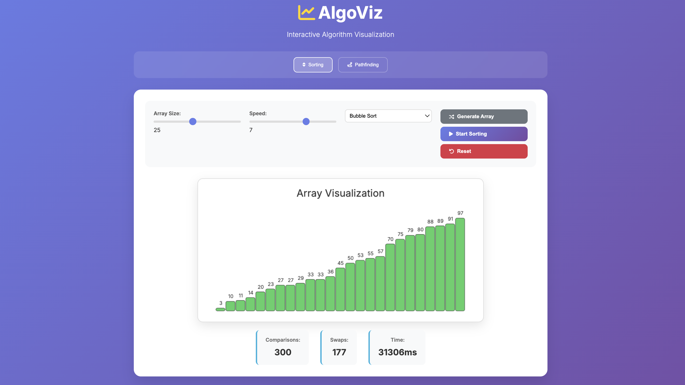
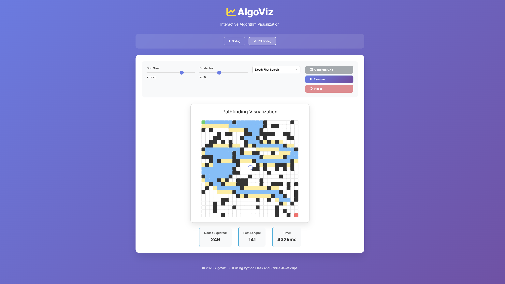

# AlgoViz 🚀

A full-stack algorithm visualizer built with Python Flask and vanilla JavaScript. Visualize classic algorithms in real-time with interactive controls and seamless animations.

## Features

- **Sorting Algorithms**: Bubble Sort, Quick Sort, Merge Sort, Heap Sort
- **Pathfinding Algorithms**: Dijkstra's, A\*, Breadth-First Search, Depth-First Search
- **Real-time Visualization**: Watch algorithms execute step-by-step
- **Interactive Controls**: Adjust speed, array size, and algorithm parameters
- **Responsive Design**: Works seamlessly on desktop and mobile
- **Clean Architecture**: Separation of concerns with Flask API and vanilla JS frontend

## Tech Stack

- **Backend**: Python 3.9+, Flask, Flask-CORS
- **Frontend**: Vanilla JavaScript, HTML5, CSS3, Canvas API
- **Deployment**: Ready for Heroku, Vercel, or any cloud platform

### Sorting Visualization



### Pathfinding Visualization



## Quick Start

1. **Clone the repository**

   ```bash
   git clone https://github.com/yourusername/algoviz.git
   cd algoviz
   ```

2. **Set up Python environment**

   ```bash
   python3 -m venv venv
   source venv/bin/activate  # On Windows: venv\Scripts\activate
   pip install -r requirements.txt
   ```

3. **Run the application**

   ```bash
   python app.py
   ```

4. **Open your browser**
   Navigate to `http://localhost:5001`

## Algorithm Implementations

### Sorting Algorithms

- **Bubble Sort**: O(n²) - Simple comparison-based sorting
- **Quick Sort**: O(n log n) average - Divide and conquer approach
- **Merge Sort**: O(n log n) - Stable divide and conquer sorting
- **Heap Sort**: O(n log n) - In-place heap-based sorting

### Pathfinding Algorithms

- **Dijkstra's**: Finds shortest path in weighted graphs
- **A\* Search**: Informed search with heuristic optimization
- **Breadth-First Search**: Level-by-level graph traversal
- **Depth-First Search**: Recursive graph exploration

## How to Use

### Sorting Visualization

1. Select the "Sorting" tab
2. Choose array size and algorithm
3. Adjust visualization speed
4. Click "Generate Array" to create a new random array
5. Click "Start Sorting" to begin the visualization
6. Watch the algorithm execute step-by-step with color-coded bars

### Pathfinding Visualization

1. Select the "Pathfinding" tab
2. Choose grid size and obstacle percentage
3. Select a pathfinding algorithm
4. Click "Generate Grid" to create a new maze
5. Click "Find Path" to begin the visualization
6. Watch the algorithm explore the grid and find the optimal path

## Contributing

1. Fork the repository
2. Create a feature branch (`git checkout -b feature/amazing-feature`)
3. Commit your changes (`git commit -m 'Add amazing feature'`)
4. Push to the branch (`git push origin feature/amazing-feature`)
5. Open a Pull Request

## License

This project is licensed under the MIT License - see the [LICENSE](LICENSE) file for details.

⭐ **Star this repo if you find it helpful!**

---

_Created by TGlenn44_
